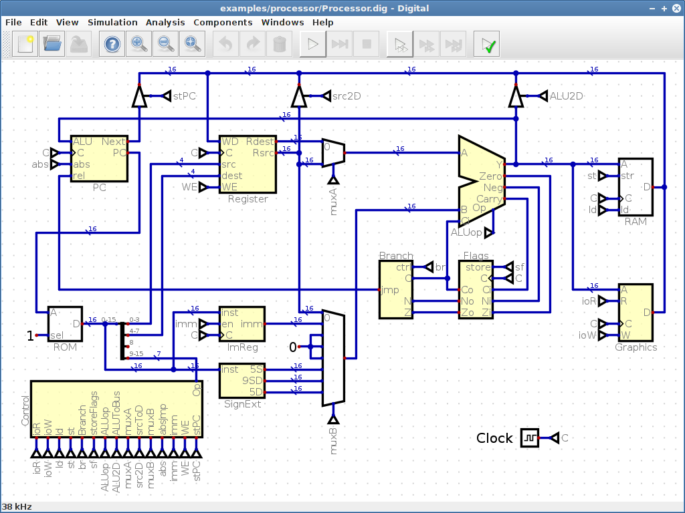

# Digital 

[Digital](https://github.com/hneemann/Digital) is an easy-to-use digital logic designer and circuit simulator designed for educational purposes.




## digital-custom-component-mqtt

### Features ##

### Dependencies

- [Digital](https://github.com/hneemann/Digital)

### Install

1. clone repo
2. build with mvn install
3. Download and run [Digital](https://github.com/hneemann/Digital)
4. Add jar (digital-mqtt-io-0.1.jar) in target to Digital
	4.1. Edit > Settings / Advanced / Java Library
5. Load circuit src/main/dig/TST01.dig
6. Change broker and topic as required
7. Launch mosquitto_sub -h test.mosquitto.org -t /digital/mqtt/test -q 1
8. Start Digital simulation
9. Click "Send" button on circuit

Notes: disconnect takes some time... if circuit is stopped without disconnecting, a thread will be left behind!

### mosquitto client

Test commands for mosquitto client:

```
mosquitto_pub -h test.mosquitto.org -t /digital/mqtt/test01 -m x

mosquitto_sub -h test.mosquitto.org -t /digital/mqtt/test -q 1
```

