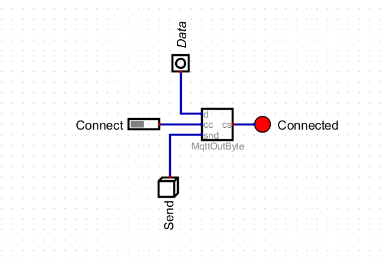
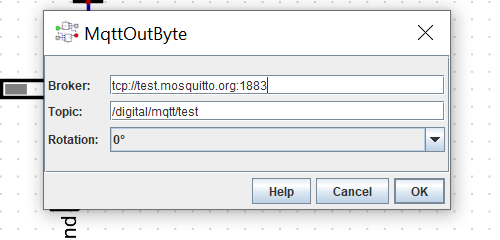

# Mqtt Component for Digital

Custom Digital component to send messages to a MTQ broker from a Digital circuit.

## Components

### MqttOutByte

Will send a byte to a configured MQTT broker / topic.

#### Settings
- Broker (ex: tcp://test.mosquitto.org:1883)
- Topic (ex: /digital/mqtt/test01)

#### Inputs
- cc: 1 bit input. On change from 0 to 1, the component will connect to the configured MQTT broker / topic. On change from 1 to 0, the client will disconnect (takes some time).
- snd: 1 bit input. When snd signal changes to 1, the value in d will be sent to MQTT broker / topic, if connected. The 8 bit value will be sent as hex string.
- d: data. 8 (fixed) bits input data to be sent to MQTT broker / topic when snd transitions from 0 to 1 and component is connected.

#### Outputs
- cs: connection status. 1 when connected to a MQTT broker / topic, 0 if not connected.

### Test circuit





Note: Not threaded, so all actions will freeze Digital simulation. 

## Digital 

[Digital](https://github.com/hneemann/Digital) is an easy-to-use digital logic designer and circuit simulator designed for educational purposes.


## Features

## Dependencies

- [Digital](https://github.com/hneemann/Digital)

## Run from Command Line

1. make sure java (java.exe) is on you PATH (tested with 1.8)
2. Download paho client: org.eclipse.paho.client.mqttv3-1.2.1.jar
3. Download Digital
4. Download mqtt Digital component: mqtt-io-0.0.1-SNAPSHOT.jar
5. Execute Digital and add MQTT component jar (mqtt-io-0.0.1-SNAPSHOT.jar) to Digital (Edit > Settings / Advanced / Java Library)
6. Shutdown Digital
7. Check that MQTT components show in menu (Components/IO/MQTT)
8. Execute from command line: 

```
java -cp Digital.jar;org.eclipse.paho.client.mqttv3-1.2.1.jar de.neemann.digital.gui.Main
```

This assumes a very simple setup (probably not recommended) where:
- paho client jar is in the same folder than Digital.jar
- In command line shell, your working folder is the root Digital folder (where Digital.jar is)


## Install and Run from source

1. clone repo
2. build with mvn install
3. Download and run [Digital](https://github.com/hneemann/Digital)
4. Add jar (mqtt-io-0.0.1-SNAPSHOT.jar) in target to Digital (Edit > Settings / Advanced / Java Library)

## Test

1. Load circuit src/main/dig/TST01.dig
2. Change broker and topic as required
3. Launch mosquitto_sub -h test.mosquitto.org -t /digital/mqtt/test -q 1
4. Start Digital simulation
5. Click "Send" button on circuit

Notes: disconnect takes some time... if circuit is stopped without disconnecting, a thread will be left behind!

### mosquitto client

Test commands for mosquitto client:

```
mosquitto_pub -h test.mosquitto.org -t /digital/mqtt/test01 -m x

mosquitto_sub -h test.mosquitto.org -t /digital/mqtt/test01 -q 1
```

